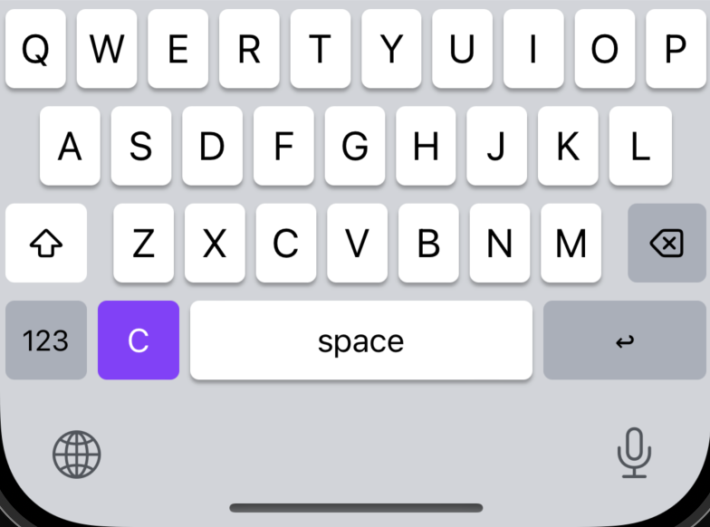
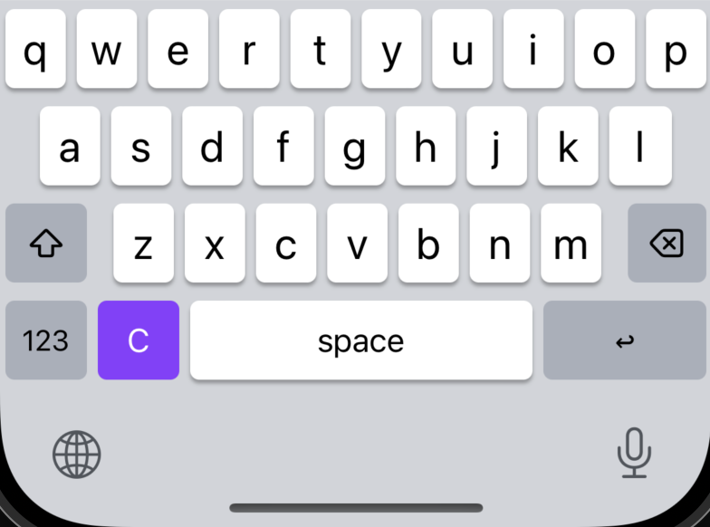
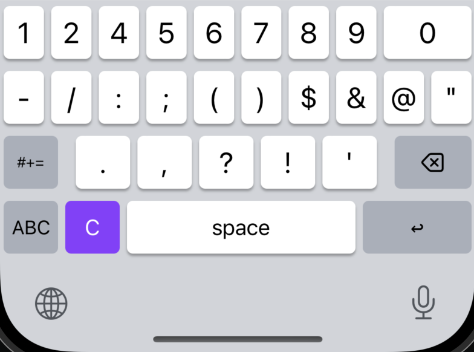
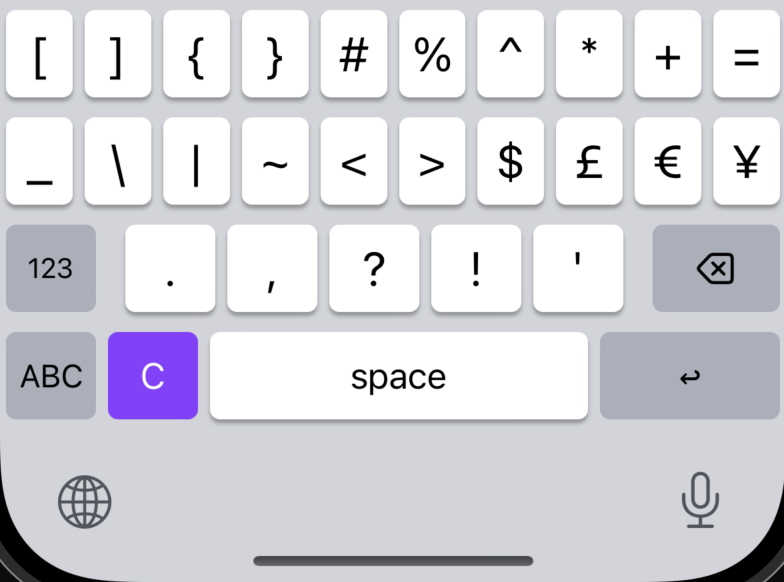
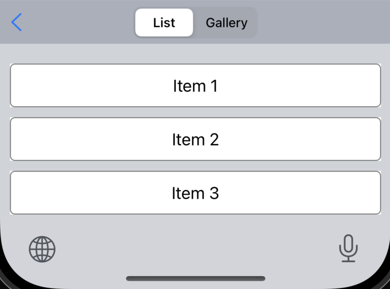
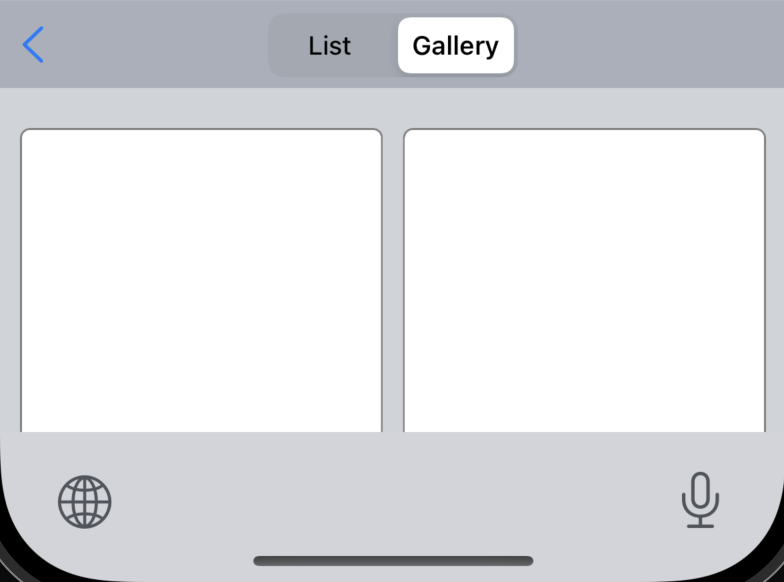

# Custom Keyboard for iOS

Recently, I needed to create a custom keyboard to test LLM for local suggestions iOS app. Unfortunately, I couldn't find good templates for that online and I had to write everything from scratch. If anybody has the same problem than me in the future please feel free to use this template as a starting point.

## Features

I tried to make the keyboard look similar to the stock keyboard, except where the emoji button is I implemented a custom button that can be mapped to do whatever you want. In this example it opens a new view were you can toggle between a list and a gallery.

| Uppercase Keys                      | Lowercase Keys                      |
:------------------------------------:|:------------------------------------:
 | 

When the keyboard opens it starts with the shift key ON. The letters are shown as capitalized until the any button is pressed. Then, it changes to a lowercase keyboard.

| Symbols 1                          | Symbols 2.                         |
:-----------------------------------:|:-----------------------------------:
 | 

When pressing the "123" button it loads a new view containing the symbols. When pressing the shift button (that now show "#+=") it switches to a second set of symbols. Pressing the "ABC" button switches back to the regular keyboard view.

| Custom View: List                     | Custom View: Gallery                     |
:--------------------------------------:|:-----------------------------------------:
 | 

The custom button (the purple "C" key) opens a new view. In theory everything is possible here. For my use I needed a list and a gallery view. It can be toggled between the two on top. The back button returns to the regular keyboard view.

## Local LLMs - Suggestions

I currently do not plan to work further on this project. But if anybody wants to fix some of the things I am happy to review some pull requests.

What I noticed what is not working at the moment:

- [ ] Caps Lock: a douple press on the shift key should switch the icon and keep the keyboard in all caps until pressed again
- [ ] Scrolling the custom view: the top bar scrolls out of sight as well
- [ ] Custom view from symbol view: if pressing the custom view button while having the symbols open it only shows an empty view
